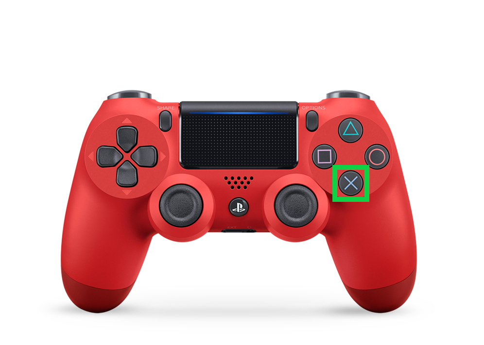

# CatchMeIfYouCan

- Universidad de La Laguna
- **Asignatura:** Interfaces Inteligentes
- **Trabajo Final de Asignatura:** juego en realidad virtual con *Unity 3D*

 

## Índice <!-- omit in toc -->

- [CatchMeIfYouCan](#catchmeifyoucan)
  - [Autores](#autores)
  - [Introducción](#introducción)
    - [Descripción del juego](#descripción-del-juego)
      - [Controles](#controles)
      - [Interfaz de usuario:](#interfaz-de-usuario)
    - [Descripción del mapa](#descripción-del-mapa)
  - [Estructura de los scripts](#estructura-de-los-scripts)
  - [Elementos externos usados](#elementos-externos-usados)
  - [Cuestiones importantes para el uso](#cuestiones-importantes-para-el-uso)
  - [Hitos de programación logrados](#hitos-de-programación-logrados)
  - [Aspectos destacables del juego](#aspectos-destacables-del-juego)
  - [Metodología de trabajo](#metodología-de-trabajo)
  - [Reparto de tareas](#reparto-de-tareas)
  - [Enlaces de interés](#enlaces-de-interés)
  - [Posibles mejoras a futuro](#posibles-mejoras-a-futuro)

 

## Autores

- Sergio de la Barrera García (alu0100953275@ull.edu.es)
- Francisco Jesús Mendes Gómez (alu0101163970@ull.edu.es)
- Sergio Tabares Hernández (alu0101124896@ull.edu.es)

 

## Introducción

Este es un proyecto para la asignatura de Interfaces Inteligentes en el que desarrollamos un pequeño prototipo de un juego de Realidad Virtual usando la herramienta Unity3D para dispositivos Android. El juego se llama Catch Me If You Can y a continuación veremos una serie de detalles sobre él.

 

### Descripción del juego

Este juego es un FPS (First Person Shooter) donde tenemos el rol de un policía y nuestro objetivo es acabar con todos los ladrones de la ciudad evitando perjudicar a los ciudadanos inocentes que se encuentran por la zona. Para ello tenemos que buscarlos en nuestro alrededor únicamente con el movimiento de nuestra cabeza para apuntar y, una vez encontrado el objetivo, dispararle y así aumentar nuestra puntuación; en el caso de darle a un ciudadano nuestra puntuación se verá afectada negativamente. Una vez abatidos todos los ladrones el juego finaliza mostrando un mensaje de felicitaciones.

#### Controles
Nuestro personaje se encuentra siempre en una posición estática en la cual solo necesita girar sobre su propio eje para encontrar a los enemigos y apuntarles con el arma. Para realizar la ejecución de un disparo se cuenta con diferentes métodos.
- Controles físicos:
   > Los botones señalados son los que realizan la acción de disparar.

   
   

   > Como al tocar la pantalla también se realiza dicha acción, el botón del cardboar también sirve para ello.

   

- Control por voz:
   > Dependiendo de la versión de android que use el dispositivo en el que se está jugando, también se dispone de la opción de disparar con el comando de voz "Shoot". Para poder utilizarlo se deberá pulsar el boton "Start Voice" que aparece en el cielo de la ciudad.

   

#### Interfaz de usuario:
   
  1. Brujula: Nos ayuda a conocer nuestra orientación espacial dentro del juego.
  2. Puntuación y número de disparos: Indican la evolución de la partida actual.
  3. Menú: Se encuentra en el cielo de la escena y está compuesto por varios botones que nos permiten iniciar la detección de voz, reiniciar la partida y cerrar la aplicación.
  4. Retícula: Nos indica el punto hacia donde mira nuestro personaje y también nos permite interactuar con los botones del menú.

 

### Descripción del mapa
Nos encontramos en el centro de una ciudad donde los enemigos están escondidos en distintos puntos de la misma.
   

 

## Estructura de los scripts
- Enemies
  - [Hit.cs](./scripts/Enemies/Hit.cs)
  - [LookPlayer.cs](./scripts/Enemies/LookPlayer.cs)
- Player
  - [SimpleShoot.cs](./scripts/Player/SimpleShoot.cs)
- SpeechRecognizer
  - [SpeechRecognizer.cs](./scripts/SpeechRecognizer/SpeechRecognizer.cs)
  - [SpeechRecognizerPlugin_Android.cs](./scripts/SpeechRecognizer/SpeechRecognizerPlugin_Android.cs)
  - [SpeechRecognizerPlugin_Editor.cs](./scripts/SpeechRecognizer/SpeechRecognizerPlugin_Editor.cs)
  - [SpeechRecognizerPlugin.cs](./scripts/SpeechRecognizer/SpeechRecognizerPlugin.cs)
- UI
  - [ButtonSound.cs](./scripts/UI/ButtonSound.cs)
  - [Compass.cs](./scripts/UI/Compass.cs)
  - [DontDestroyThis.cs](./scripts/UI/DontDestroyThis.cs)
  - [ExitGame.cs](./scripts/UI/ExitGame.cs)
  - [Restart.cs](./scripts/UI/Restart.cs)
- [GameController.cs](./scripts/GameController.cs)

 

## Elementos externos usados
Se ha hecho uso de distintos assets creados por la comunidad y/o disponibles en la Unity Asset Store
- [Gaze UI for Canvas](https://assetstore.unity.com/packages/tools/gui/gaze-ui-for-canvas-70881)
- [Toony Tiny City Demo](https://assetstore.unity.com/packages/3d/environments/urban/toony-tiny-city-demo-176087)
- [Fantasy Skybox Free](https://assetstore.unity.com/packages/2d/textures-materials/sky/fantasy-skybox-free-18353)
- [Easy Primitive People](https://assetstore.unity.com/packages/3d/characters/easy-primitive-people-161846)
- [Modern Guns: Handgun](https://assetstore.unity.com/packages/3d/props/guns/modern-guns-handgun-129821)
- [Fireworks](https://assetstore.unity.com/packages/3d/props/weapons/fireworks-101035)
- [Google VR SDK](https://github.com/googlevr/gvr-unity-sdk/releases#google_vr_sdk_for_unity_v08)
- [Android Speech Recognizer](https://github.com/EricBatlle/UnityAndroidSpeechRecognizer)

 

## Cuestiones importantes para el uso
- Para su correcta visualización es necesario disponer de un dispositivo VR de tipo cardboard en el que insertar el teléfono que ejecuta la aplicación.
- Para hacer uso del reconocimiento de voz es necesario asignar previamente los permisos de acceso al micrófono (Da problemas con algunos dispositivos dependiendo de la versión de android que disponga). Como alternativa, se pueden realizar los disparos con el uso del botón del que disponen algunas versiones del cardboard, el cual funciona realizando pulsaciones en la pantalla; o de un mando externo conectado al dispositivo, ya sea por Bluetooth o por cable.

## Hitos de programación logrados
- Speech Recognizer para disparar sin necesidad de un mando físico.
- Sistema de puntuación para tener constancia del progreso de la partida.
- Pantalla de fin de partida para obtener las correspondientes felicitaciones.
- Efectos de sonidos, voces y música para mejorar la experiencia de usuario.
- Botón para reiniciar la partida correctamente.
- Botón para salir de la aplicación.

 

## Aspectos destacables del juego
- Al no tener un control basado en el desplazamiento, no hay tanto movimiento para llegar al punto de marear al usuario, además que la función de reiniciar el juego mantiene al posición a la que estás mirando y la música continua sonando sin interrupción evitando así que este reinicio se realice de forma brusca para el usuario y no rompa inmersión en el juego.
- Todos los assets utilizados han sido elegidos minuciosamente para que, al fusionarlos, el diseño del videojuego cree un ambiente uniforme donde ninguno de los elementos destaque por tener una estética diferente y, a esto, añadiendo sonidos acorde a dicha estética.

 

## Metodología de trabajo
Hemos utilizado la herramienta "Collaborate" que proporciona Unity, integrada en su interfaz, y que ofrece un control de versiones para poder añadir y/o eliminar cambios que se han ido realizando a lo largo del desarrollo del proyecto.
También hemos llevado a cabo una serie de reuniones periodicas, tanto para añadir funcionalidades y desarrollar ideas como para corregir fallos de la aplicación en el caso de que los tuviese.

 

## Reparto de tareas
- Sergio de la Barrera García
  - Diseño e implementación del sistema de puntiación.
  - Creación e implementación de los efectos de sonido y la música.
  - Implementación de la pantalla de fin de partida.

- Francisco Jesús Mendes Gómez
  - Implementación del sistema de disparos.
  - Doblaje de voz para algunos de los sonidos.
  - Desarrollo de la funcionalidad del reinicio de la escena.

- Sergio Tabares Hernández
  - Creación del escenario.
  - Diseño de los personajes.
  - Implementación del reconocimiento de voz.

- Tareas en común
  - Diseño de la interfaz de usuario.
  - Desarrollo del controlador de la escena para el correcto funcionamiento del juego.
  - Realización de pruebas del producto final.

 

## Enlaces de interés
- [APK del juego](./catchMeIfYouCan.apk)
- [Proyecto Unity](./Proyecto%20Unity/)

 

## Posibles mejoras a futuro
- Ya que tenemos una brújula integrada en el juego, tenemos pensado añadir un sistema de pistas con el que se le indica hacia donde se encuentra un enemigo.
- Añadir un contador regresivo que indique el número de enemigos restantes.
- Añadir distintos escenarios para dotar al juego de multiples niveles y un modo historia.
- Dotar de movimiento e inteligencia artificial a los enemigos.
- Aumentar la integración del sistema de reconocimiento de voz para un mayor número de dispositivos.
- Implementar un sistema de movimiento que permita recorrer la ciudad en busca de los ladrones escondidos en lugares inaccesibles desde el lugar de partida.
- Realizar la integración del juego con otros dispositivos de realidad virtual disponibles en el mercado.
